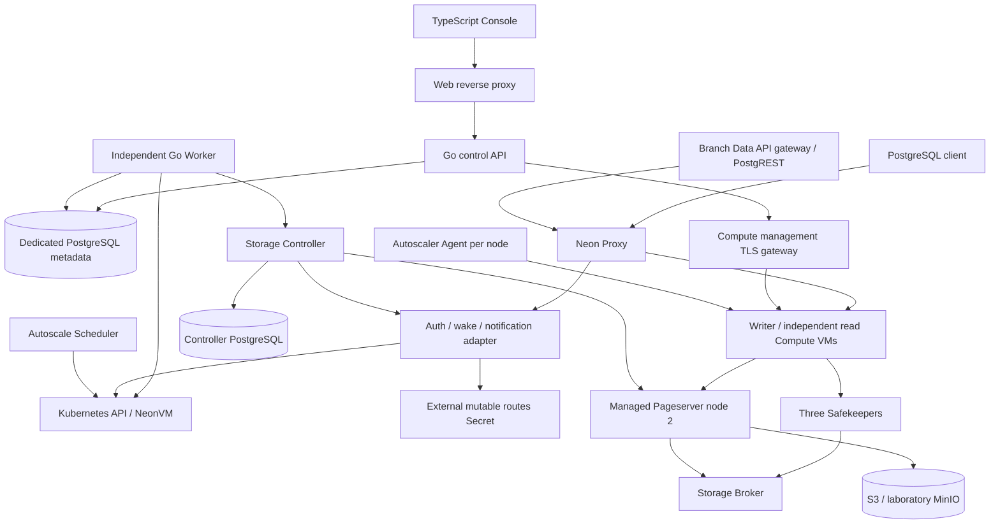
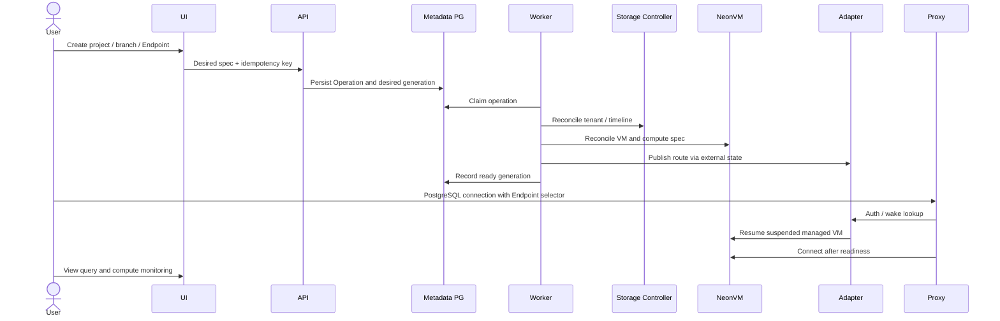

# Architecture and component coverage

## 1. Scope

The stack unifies the runtime components present in the locked open-source
distribution and the current control product. Helm owns declarative base
workloads; PostgreSQL owns desired product state; Drivers reconcile tenant,
timeline, Endpoint, VM and branch Data API resources. End users connect through
Proxy, so suspended Computes can wake without exposing individual VM addresses.

## 2. Chart and deployment ownership

| Chart / release | Namespace | Runtime responsibility |
|---|---|---|
| neonvm / neonvm | default (release), neonvm-system (pods) | CRDs, controller, KVM device plugin, VXLAN, runner loader, certificates, platform priority |
| neon-autoscaler / neon-autoscaler | default (release), kube-system (pods) | upstream scheduler and node agents |
| neon-metadata / neon-metadata | neon | optional single-instance laboratory metadata PostgreSQL/PVC; use external HA PostgreSQL for production |
| neon-adapter / neon-adapter | neon | current auth, wake and attach hook compatibility adapter with limited RBAC |
| neon-core / neon-lab | neon | object store, controller DB, controller, broker, retained node-1 Pageserver, three Safekeepers, Proxy |
| neon-managed-pageserver / managed-pageserver | neon | controller-managed node-2 Pageserver, config and retained cache PVC |
| compute-management-gateway / neon-compute-management-gateway | neon | authenticated internal compute management connection, image runtime |
| neon-control-plane / neon-control-plane | neon | API, Worker, Console, RBAC and certificate references |
| neon-compute (optional) | neon | original static VM, only with real existing tenant/timeline and spec Secret |
| data-api-gateway (optional) | neon | independently configured gateway; native branch gateway is Driver-managed |

Cert-manager, Multus, Whereabouts, CNI, metrics-server and the CSI/storage
provisioner are distribution prerequisites. The stack does not replace a
distribution's networking or etcd. Cert-manager certificates used by the stack
are namespaced; node plugins require documented host privileges.

The 46-image build distribution also includes build/test utilities, alternate
PostgreSQL majors and optional tools. They are recorded in the full image lock;
deploying all 46 as resident workloads would be incorrect. The default stack
deploys only the runtime roles above; Compute/runner and branch gateway images
are consumed dynamically when the user creates an Endpoint.

## 3. Creation and wake lifecycle

Vertical CPU/memory autoscaling is performed by upstream Agent/Scheduler/VM.
Lifecycle scale-to-zero is driven by the control product's inactivity policy,
and wake by Proxy/adapter. Read replicas are independent read-only Endpoints;
they are not a StatefulSet replica counter. Distributed suspend/wake fencing
is still an independent gate; one Adapter replica is deliberate.

## 4. Safety boundaries

Eight releases allow readiness checks between dependencies and per-component
rollback planning. Databases, WAL and object storage have durable identities;
their rollback cannot be inferred from a successful Helm command. No tool
force-replaces PVCs, steals another release, resets mutable Secrets or upgrades
existing CRDs automatically. See the upgrade and production gate documents.
