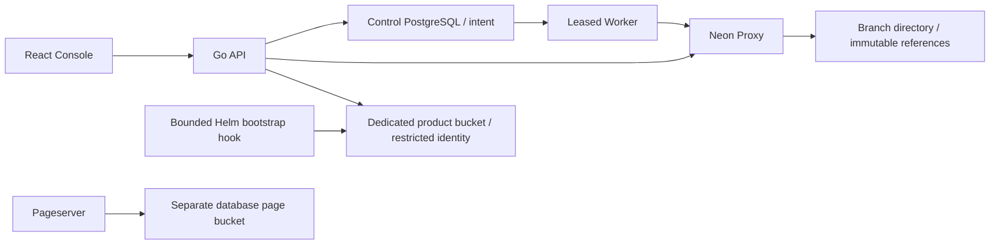

# Branch Object Storage deployment and verification

## 1. Capability and architecture

This increment installs a real branch Object Storage REST service. Its directory
and immutable blob references live in the branch's `neon_storage` PostgreSQL
schema. Bytes live in a separate `neon-product-blobs` bucket. Native timeline
branching inherits the directory; overwrites in a child do not change the parent.
API/Worker/Web stay separate. Runtime workloads use the seven published control
images selected by `stack.controlImagesLock`.

The external protocol is **`neon-object-rest-v1`**, not S3. The backing transport
uses SigV4. Public S3 SDK compatibility, multipart, object event triggers,
physical GC and complete cross-domain disaster recovery remain separate gates.
Follow the pinned control repository's `docs/OBJECT-STORAGE.md` and OpenAPI for
the exact API and model contract.



## 2. Credentials and existing cluster upgrade

Never replace an existing identity or publish its Secret. Back up full Helm
values, Secrets and PVC identities before the maintenance window. Keep the live
Proxy certificate name/CA; fresh-profile defaults cannot override existing trust.

For this feature only, on Linux:

```bash
node tools/prepare-product-storage.mjs \
  --output /secure/operator/product-storage-unique-attempt \
  --endpoint http://minio.neon.svc.cluster.local:9000 --lab-http
kubectl -n neon create -f \
  /secure/operator/product-storage-unique-attempt/neon-product-blob-store.private.json
```

The standalone tool uses only Node built-ins, creates protected files, refuses
overwrite and prints no credentials. Fresh whole-stack bootstrap creates this
ninth Secret with the other inputs. Do not rerun whole-stack bootstrap on an
existing cluster. `--lab-http` acknowledges this laboratory transport exception;
production requires independently accepted trusted TLS.

Set the following additions in the corresponding **complete existing values**:

```yaml
# neon-core
minio:
  productStorage:
    enabled: true
    bucket: neon-product-blobs
    existingSecret: neon-product-blob-store
# neon-control-plane
objectStorage:
  enabled: true
  existingSecret: neon-product-blob-store
```

Use `stack.mjs` inspect/preflight/apply/verify and `audit-live.mjs` as documented
in UPGRADE.md. Its core post-upgrade hook creates the separate bucket and a new
restricted user. The policy allows bucket listing and object reads/writes only
on the product bucket; it does not allow physical deletion or database-bucket
access. Root credentials are available only to the bounded bootstrap hook.
API and Worker mount the product configuration read-only. Migration 017 retains
all previous schema migrations and data. Failed hook receipts must be inspected;
never ignore a failed hook or delete a data bucket to repair configuration.

The first real bootstrap was OOMKilled (exit 137) at a 128 MiB container limit,
with 9–10 GiB still available on each host. This was a process budget failure,
not proof of host memory exhaustion. The bounded hook and IAM probe now request
128 MiB, allow 512 MiB and set `GOMEMLIMIT=128MiB`. Phase messages identify the
failing step without exposing credentials. Both hooks declare release ownership;
an earlier hook retained by a failed upgrade must first be archived and retired
with exact Job UID/resourceVersion checks. Never weaken general adoption guards
to make an unrelated unowned resource pass inspection.

## 3. Real permissions and UI acceptance

After deployment, run the read-only real IAM check:

```bash
node tools/verify-product-storage-access.mjs \
  --output /secure/operator/storage-access-unique-attempt
```

It uses only the product Secret in a restricted, bounded Job. It requires a
successful product bucket listing and an explicit AccessDenied for the database
bucket; network errors cannot pass. It retains the original Pod UID/log/evidence.
Delete only that terminal Job after archiving its manifests/logs and rechecking
the exact owner UID/resourceVersion. No blob, Secret or PVC is removed.

In the Console create a bounded project, grant the controlled schema installation
permission in SQL Workbench (`GRANT CREATE ON DATABASE postgres TO control_probe`),
enable Object Storage, create/upload/list/download, branch and overwrite the
child, verify the parent, and test cold wake after suspension. Metadata polling
must leave the writer at zero. Test private/public downloads, conditional writes,
stale/tampered signed links, deletion and retained project recovery.

Run `web/e2e/object-storage.spec.ts` from the matching public control source on an
authorized Linux runner. Follow its protected password/fixture/evidence input
contract. It begins with real UI actions and supplements them with protocol
negative/concurrency checks. It uses one project and at most two compute writers
serially; successful teardown retains data/tombstones and releases test quota.
Do not repeat a failed attempt blindly or discard its private fixture.

Limits are 8 MiB per upload, 100 MiB and 1,000 visible objects per branch, 32
logical buckets, eight enabled/provisioning storage instances and eight concurrent
requests per API process. They are preview limits, not distributed physical-byte
quota or global rate-limit certification. Immutable overwritten/orphan/historical
bytes remain until a separately proven reference-aware garbage collector exists.
